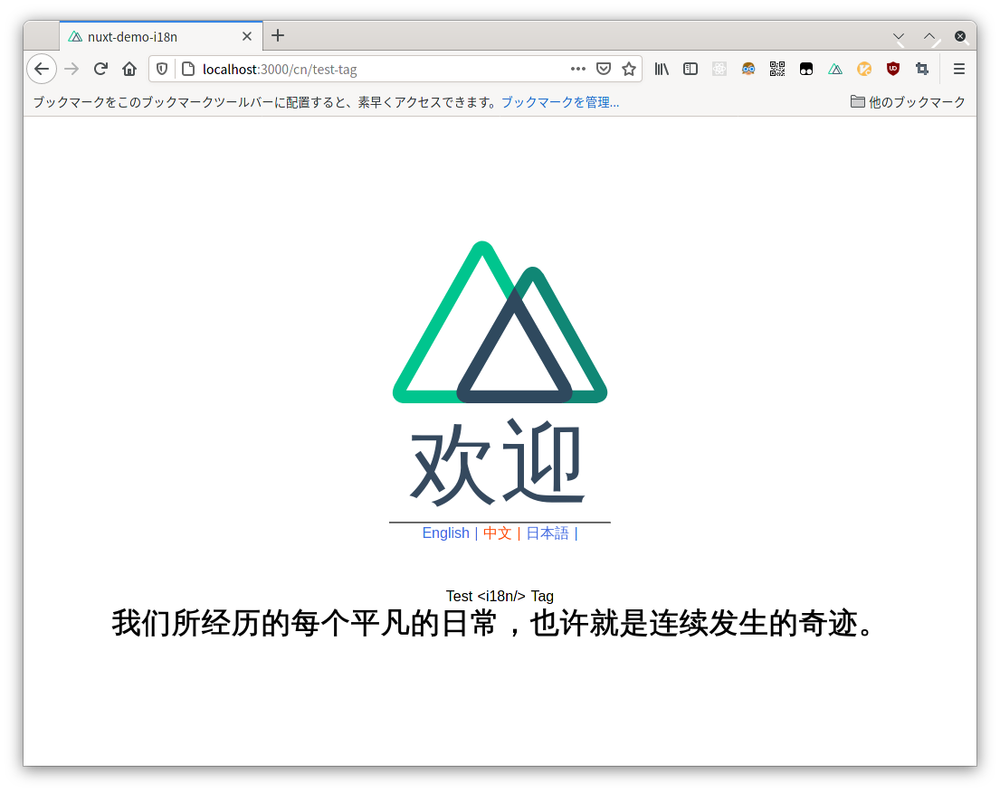

# nuxt-demo-i18n

Nuxt.js i18n module Demo



## Contents

- [x] Language switcher components
- [x] Multiple page switch
- [x] Lazy Loading
- [x] Component `<i18n/>` tag
- [x] Detect browser language (alwaysRedirect)

## Build Setup

```bash
# install dependencies
$ yarn install

# serve with hot reload at localhost:3000
$ yarn dev

# build for production and launch server
$ yarn build
$ yarn start

# generate static project
$ yarn generate
```

For detailed explanation on how things work, check out [Nuxt.js docs](https://nuxtjs.org).
